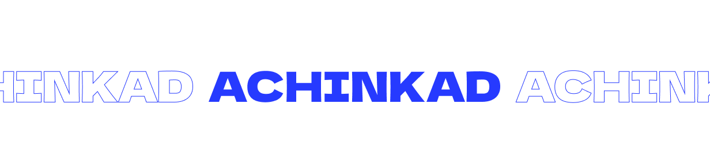

## Achinkad

    

Welcome to **Achinkad**, a collection of projects developed during Bachelor’s and Master’s studies at the Polytechnic of Leiria. This organization showcases diverse academic and technical work, reflecting the application of various programming languages and frameworks.

### About

Achinkad is dedicated to sharing projects that demonstrate problem-solving skills, practical applications, and innovation across a variety of fields. Each repository within Achinkad highlights a unique academic project, providing insights into the development process and outcomes.

### Technologies Used

The projects within this organization leverage a broad range of technologies, including:

- **Backend & Web Development**: Laravel, PHP and Node.
- **Programming Languages**: C, C#, Java, Rust and Python.
- **Frontend Framework**: JavaScript, Vue and React.
- **Data Science & Analysis**: Jupyter Notebook.
- **Scripting**: Bash and Perl.

### Contributions

The repositories are organized to help others explore each project's objectives, design, and implementation details. Feel free to browse, learn, and contribute where possible.
